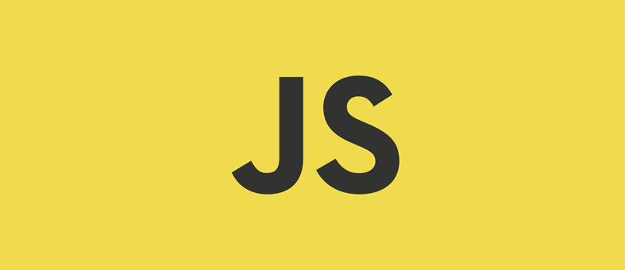

## 🏻 Tools and Skills🔗

# FirstSite

> Imagem mostrando uma prévia da linguagem que foi usada neste projeto, se ficou curioso aqui está todos os códigos.

### Ajustes e melhorias 🚀

Basicamente o projeto foi capaz de realizar as seguintes tarefas:

- [x] Exercitar a lógica de programação 1
- [x] Capacidade de compreensão da sintaxe 2
      
